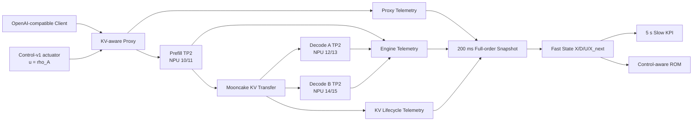

# ServingROM 当前进展与实验效果

> 状态日期：2026-08-24
> 工程仓库：`/home/admin/Desktop/sql/qwen36_pd_1p2d`
> 运行平台：Ascend 910C、Qwen3.6-27B-w8a8、vLLM-Ascend 1P2D

## 1. 执行摘要

ServingROM 已经完成从推理系统旁路遥测到真实运行时 actuator 的主链路：统一遥测、Proxy/Engine/Mooncake 生命周期关联、200 ms Full-order Snapshot、ROM Dataset、POD/DMDc、失败归因、多速率状态/输出设计、Control-v1 路由控制器、控制激励 Pilot 和正式 Control Dataset v1 均已落地。

当前最重要的科学结论是：`rho_A` 已被证明是一个真实、可执行、可审计、可回滚且对 Decode A/B 状态具有显著控制权的 actuator；但是现有 Control-ROM 尚不能稳定预测控制造成的 A/B inventory 差异在自由 rollout 中的积累和恢复。因此项目现在处于“系统与数据就绪，控制动力学模型尚未就绪”的阶段，MPC 仍应保持关闭。

```text
telemetry_ready              = true
snapshot_ready               = true
fixed_config_dataset_ready   = true
actuator_ready               = true
control_excitation_ready     = true
control_dataset_ready        = true
control_identifiability_ready= true
control_representation_ready = true
memory_dynamics_ready        = false
control_rom_ready            = false
mpc_ready                    = false
```

## 2. 冻结系统架构

正式 ServingROM 基线使用以下 1P2D 拓扑：



冻结配置：

```text
model                 = Qwen3.6-27B-w8a8
topology              = Prefill TP2 + Decode A TP2 + Decode B TP2
KV connector          = Mooncake
decode graph mode     = FULL_DECODE_ONLY
async scheduling      = enabled
Control-v1 actuator   = u=rho_A, rho_B=1-rho_A
safe range            = [0.2, 0.8]
minimum dwell         = 5 s
maximum single step   = 0.2
```

截至本文生成时，相关 Deployment 均已缩容为 0，没有 ServingROM 模型或采集任务占用 NPU。生命周期脚本位于 `server-00:/home/admin/testpanxy/infralearning/pd_1p2d_control_v1/`。

## 3. 阶段总览

| 阶段 | 状态 | 主要产物 | 结论 |
|---|---|---|---|
| Step 1 统一遥测 | PASS | `servingrom_telemetry/` | 双时钟、ID、异步 writer、drop/flush 可审计 |
| Step 2 Proxy 生命周期 | PASS | Proxy events/lifecycle pipeline | trace/attempt/request 可完整重建 |
| Step 3 Engine 事件 | PASS | vLLM/vLLM-Ascend patches | iteration、membership、调度和设备状态可采集 |
| Mooncake 最小闭环 | PASS | rank/request KV Parquet | 传输与请求、TP rank 完整关联 |
| Step 6/7 Snapshot | PASS | `X[1804],D[31],Y[19],MU[12]` | 200 ms 全阶状态与守恒验证通过 |
| Dataset v1/v1.1 | SEALED | 201,600 windows | 统一 TTFT SLO，无重采、无数据泄漏 |
| Step 9 数据审计 | PASS | train-only normalizer | 1360/1804 恒零或近常量，MU 全局恒定 |
| Step 10 POD | PASS | rank 16–192 扫描 | rank 不按单一能量阈值冻结 |
| Step 11/12 DMDc | 部分通过 | rank16 linear ROM | 状态稳定，关键 KPI rollout 不足 |
| ServingROM-v2 | PASS | 200 ms fast + 5 s slow | 慢速 KPI 显著改善输出预测 |
| Step 13A/13B Control-v1 | PASS | route-ratio actuator | 无重启热更新、回滚与 failure injection 通过 |
| Round 14.1 Pilot | PASS | 12-run pilot | persistent excitation/control authority/data quality 全通过 |
| Round 14.2 Dataset | SEALED | 36-run Control Dataset v1 | 数据和可辨识性均 ready |
| Round 14.3 Held-out | BLOCKED | 10-run benchmark plan | 首 run 完成但被验证器误判，未封存 |
| Step 15 Control-ROM | FAIL CLOSED | standard POD ROM | 低能量 differential modes 丢失 |
| Step 15B 表示重设计 | REPRESENTATION PASS | `gc12-diff2` | 静态可观测性修复，动力学未通过 |
| Step 15C-1 记忆重设计 | FAIL CLOSED | memory ablation | 有限记忆不是主要瓶颈 |
| Step 15C-2 effective forcing | NOT STARTED | 待实现 | 下一主线步骤 |
| MPC | NOT STARTED | 无 | Control-ROM 未通过前禁止进入 |

## 4. 遥测和生命周期闭环

### 4.1 统一事件基础

所有事件使用 wall clock 和 monotonic clock，持续时间只由 monotonic time 计算。事件唯一键为 `(run_id, process_instance_id, event_seq)`，请求标识分为 `trace_id`、`attempt_id`、物理 `request_id` 和客户端 `external_request_id`。

业务线程只执行轻量事件封装和非阻塞入队，后台 writer 负责批量 JSONL、flush、轮转和 summary。遥测关闭时使用 `NullEmitter`，不创建线程和输出文件。100k/1M 合成事件压力测试及队列、轮转、磁盘错误隔离测试已经完成。

### 4.2 Proxy 到 Engine

Proxy 能重建 arrival、admission、Prefill HTTP、P-to-D route、Decode HTTP、流式 chunk、retry/recompute 和终态。每个 trace 恰好存在一个 complete/reject/cancel/error 终态，重算 attempt 时 trace 不变、attempt 递增、request ID 更新。

Engine 侧补充 Prefill/Decode iteration、batch membership、scheduled tokens、running/waiting、KV usage、forward/postprocess 时间和设备指标。无法无扰获得的字段记录为 `null` 并在 capability 中声明，不使用伪造的 0。

### 4.3 Mooncake 闭环

早期 Python hook 未命中，是因为 Ascend 实际 KV 传输路径和最初假设的 connector 层不同。runtime capability marker 定位真实 TransferEngine 后，旁路接入 enqueue/start/complete/fail 四类事件。

最终 Mooncake 验证结果：

```text
request-level KV transfers = 13/13
rank-level KV transfers    = 26/26
expected/completed ranks   = 2/2
missing ranks              = 0
actual transferred bytes   = non-null
KV ready time              = calculable for all requests
writer drop                = 0
JSONL corruption           = 0
event_seq gap              = 0
Pod restart/fatal          = 0
```

仍无法无扰获得的是硬件 DMA 内部子阶段和 fabric 层真正完成时刻；这不会阻断当前 request-level ROM，但限制了对传输微结构的更深建模。

## 5. Full-order Snapshot 与固定配置数据集

Step 6/7 将异步事件按 200 ms 半开窗口重建为：

```text
X[1804] : 库存、队列、KV、running/waiting、token bins、membership 等状态
D[31]   : 外部请求到达和 workload disturbance
Y[19]   : throughput、goodput、TTFT/TPOT、KV 和调度完成量
MU[12]  : run 内固定系统配置
```

Phase A 生成 942 个窗口并通过请求库存、阶段库存、KV 生命周期和 writer 守恒。空窗口被保留为真实 zero-work sample；“窗口内没有 scheduler event”不再被错误解释为数据缺失。

正式 Dataset v1 共 201,600 个窗口。Dataset v1.1 只读地从原始 telemetry 重建，统一使用 TTFT SLO 和 goodput 语义，没有重新采集，也没有修改 v1。train/validation/test/test-transient 按完整 run 隔离。

Step 9 审计结果：

```text
train/validation/test/test-transient runs = 24/24/24/12
X constant or near-constant dimensions   = 1360/1804
X effective dimensions                   = 444
MU constant over complete dataset        = true
```

归一化只在 train 上拟合。各维先 z-score，再按物理 block 的有效维数平方根平衡，防止 KV bytes、token mass 和高维 histogram 主导 POD。

## 6. 基础 POD/DMDc 的效果与失败

POD 扫描 rank `16/32/48/64/96/128/192`。rank 越高，静态重构误差持续下降；例如 validation reconstruction 从 rank16 的 `0.7182` 降至 rank192 的 `0.0571`。但高 rank 并不自动意味着更好的动力学泛化，因此全部候选进入 validation 动力学选择。

最终基础线性模型为：

```text
z[k+1] = A z[k] + E d[k] + c
y[k]   = C z[k] + F d[k] + b
rank   = 16
ridge  = 10
rho(A) = 0.93938681
```

状态预测结果：

| Split | State rollout NRMSE | Output rollout NRMSE |
|---|---:|---:|
| validation | 0.741451 | 0.795843 |
| test | 0.725892 | 0.802494 |
| transient | 0.672144 | 0.827855 |

模型数值稳定且状态整体优于均值/持久性基线，但关键输出失败：validation/test/transient 的 completed tokens、goodput、TTFT、TPOT NRMSE 大约在 `0.962–0.981`。因此 Step 13 的 `key_output_rollout_accuracy` 门失败，基础模型没有资格直接进入 MPC。

## 7. ServingROM-v2 多速率重设计

失败归因发现三个结构性问题：

1. 200 ms 的完成事件和延迟输出高度零膨胀；
2. POD 优化全局状态能量，未保护 goodput/TTFT/TPOT 所需的低能量方向；
3. 一阶状态缺少积压/恢复方向所需的短期历史。

因此冻结为多速率架构：200 ms Fast State 保留库存动力学，5 s Slow KPI 对 25 个 fast windows 做守恒聚合。无 completion 的窗口使用 validity mask，不把缺失延迟伪装成 0 ms。

Slow KPI held-out NRMSE：

| Split | completed tokens | goodput | TTFT | TPOT |
|---|---:|---:|---:|---:|
| validation | 0.582 | 0.597 | 0.626 | 0.570 |
| test | 0.583 | 0.612 | 0.612 | 0.584 |
| transient | 0.601 | 0.628 | 0.654 | 0.611 |

相较原 200 ms 输出头约 `0.96–0.98` 的关键 KPI 误差，这是明确改善。它说明内部库存与外部 KPI 不应共享一个观测时钟，但还不能替代合格的 Control-ROM。

## 8. Control-v1 actuator

Step 13A 审计了四类候选 actuator。只有 Decode A/B 路由比例具备明确、安全且无需修改 Engine 深层结构的热更新语义：

```text
u = rho_A
rho_B = 1-rho_A
safe range = [0.2,0.8]
minimum dwell = 5s
max delta = 0.2
```

token budget、max active sequences 和 Prefill budget 被标为 `DEFERRED/NOT_SUPPORTED`，因为尚无跨进程安全热更新证据，且可能影响 graph、KV 和 async scheduling。

Control plane 实现 PREPARE/COMMIT、CAS generation、唯一 command ID、幂等重放、越界/驻留/步长拒绝、rollback 和 unhealthy Decode fallback。Runtime smoke 完成 180 个真实请求：

```text
rho_A=0.3 -> Decode A/B = 6/14
rho_A=0.5 -> Decode A/B = 10/10
rho_A=0.7 -> Decode A/B = 14/6
```

请求到 applied 的控制开销约 1.05–1.15 ms，下一次 Decode route 在约 195–203 ms 后观察到新 generation。固定 `temperature=0, seed=1024` 的全部输出 SHA256 一致；Pod/Engine restart、模型 reload、graph recapture、Mooncake reinitialize、OOM 和 engine death 均为 0。

## 9. Round 14.1 控制激励 Pilot

Pilot 在同一个常驻 Pod 上执行：

```text
2 workloads x 2 loads x 3 excitation families = 12 runs
每 run = 120s warmup + 600s excitation + drain
fast windows = 36,000
slow windows = 1,440
successful requests = 2,848
completion tokens = 339,136
```

三个门全部通过：

```text
persistent_excitation_pass = true
control_authority_pass     = true
data_quality_pass          = true
```

从 `rho_A=0.3` 提高到 `0.7` 后，running imbalance 的 Cohen's d 为 `1.176–1.840`，remaining-token imbalance 为 `0.786–1.417`，方向全部正确。新请求和 running 通常在 0–5 秒内响应，remaining-token settling 约为 7.5–20 秒。高负载下差分状态更容易辨识；waiting 效应较弱，说明 Pilot 工作点尚未形成长期 scheduler backlog。

## 10. Round 14.2 正式 Control Dataset v1

正式矩阵为：

```text
2 workloads x 3 loads x 2 arrival processes x 3 split seeds = 36 runs
loads = 55%, 75%, 92%
arrival = poisson, on_off_burst
train/validation/test = 12/12/12 complete runs
```

封存结果：

```text
runs                   = 36/36
fast windows           = 108,000
slow KPI windows       = 4,320
fast windows per split = 36,000
X/D/U/X_next           = 1804/31/1/1804
immutable              = true
control_dataset_ready  = true
control_identifiability_ready = true
```

所有 workload/load/arrival 聚合组的路由方向和至少一个核心 Decode 状态效应通过。`rho_A=0.7` 的 routed A fraction 约为 `0.67–0.69`，`rho_A=0.3` 约为 `0.30–0.36`。running imbalance Cohen's d 约为 `0.60–1.21`，remaining-token imbalance 约为 `0.50–0.97`；waiting imbalance 仍然较弱。

这里严格保持数据语义：`U[1]` 只来自 `actuator_applied.effective_value`；actual request ratio、actual token ratio 和 scheduler 状态是 response/diagnostic，不是控制输入。

## 11. Step 15：标准 Control-aware ROM

第一版模型：

```text
z[k+1] = A z[k] + L delta_z[k] + E d[k] + M d[k-1] + B u[k] + c
Y[j]   = Cs Z[j] + Fs D[j] + Hs U[j] + bs
```

validation 选择线性 rank16、ridge100，增广谱半径 `0.927712`。Fast state rollout 在 validation/test 为 `0.723/0.739`，Slow KPI 为 `0.561/0.547`，并且反事实控制方向正确。Bilinear 候选仅改善 `0.000334`，未保留。

真正失败的是 POD 控制状态重构：

| State | rank16 validation reconstruction NRMSE |
|---|---:|
| waiting imbalance | 0.0586 |
| running imbalance | 1.0014 |
| remaining-token imbalance | 1.2754 |

这说明普通 POD 保留了系统总体高能量变化，却丢失了 `rho_A` 直接驱动的低能量 A/B differential modes。Step 15 因而正确地 fail closed。

## 12. Step 15B：Control-Relevant Representation

Step 15B 比较两条路线：

1. 普通 POD 加显式 A/B differential descriptors；
2. 将 A/B 状态拆成 common `(A+B)/2` 和 differential `(A-B)/2`，分别分配 POD rank。

最终冻结 Scheme 2：

```text
representation = common/differential block POD
global/common rank = 12
differential rank  = 2
total dimension    = 14
name               = gc12-diff2
```

表示层静态重构已经通过：

| Split | running | waiting | remaining-token |
|---|---:|---:|---:|
| validation | 0.488 | 0.183 | 0.613 |
| test | 0.483 | 0.172 | 0.598 |

但是自由 rollout 仍然接近 train-mean 基线：validation `0.953/1.000/0.972`，test `0.952/0.999/0.971`。因此结论是 `control_representation_ready=true`，但 `control_rom_ready=false`。这是关键分界：状态已经可观测，失败转移到了动力学结构。

## 13. Step 15C-1：有限记忆诊断

Step 15C-1 冻结 `gc12-diff2`，只在 train/validation 上扫描三类线性记忆：

```text
raw finite lag
multi-scale mean/integral/change
exponential memory state
horizons = 1/2/5/10/20 s
```

最佳诊断候选为 exponential 1s、memory dimension 6、ridge10、谱半径 `0.947827`。但 test 结果仍为：

```text
running rollout NRMSE        = 0.967794
waiting rollout NRMSE        = 0.999516
remaining-token rollout      = 0.967122
global rollout NRMSE         = 0.843960
Slow KPI NRMSE               = 0.358169
control-direction pass       = 0.666667
```

1–20 秒记忆没有把核心 imbalance rollout 降到 `<0.75` 的 strong gate。记忆改善了全局状态和 Slow KPI，却没有恢复路由对 A/B inventory 的有效注入。因此 `memory_dynamics_ready=false`，有限记忆不是主导瓶颈。

## 14. Round 14.3 Held-out 当前阻断

Held-out benchmark 计划 10 个独立 `test/control-heldout` run，包括 0.4/0.6 interpolation、unseen composite、slow ramp 和 0.2/0.8 boundary-near。它们不会进入 train/validation。

当前 manifest：

```text
SEALED  = 0
FAILED  = 1
PENDING = 9
status  = STOPPED_FAIL_CLOSED
```

首个 `balanced-l75-interpolation` 工作负载实际上已经完成，拥有 3,000 fast windows、120 slow windows、263 请求、21 次控制变化、约 15 秒最小 dwell，且 inventory/KV/writer/Pod restart 门全部通过。失败来自验证器将健康状态字符串 `"ok"` 按整数 HTTP `200` 判断，产生错误的 `health_sample_failure`。

这个问题属于 validator 语义错误，不是推理或数据故障。正确恢复方式是修复验证器、对已有 run 重新验证并封存，然后继续剩余 9 runs；不应重采首个 run。

## 15. 当前失败机制的统一解释

当前模型链路可以分成三层：

```text
command layer:     rho_A
forcing layer:     实际 routed request/token-mass injection
inventory layer:   running/waiting/remaining-token A-B difference
```

Control-v1 和 Round 14.1/14.2 已证明 command layer 有效；Step 15B 已证明 inventory layer 可被 reduced representation 观测。现有模型直接尝试由 `rho_A` 和 workload disturbance 预测 inventory，却缺少二者之间实际发生的 routed workload forcing。

概率路由只决定“新请求选择 A 的概率”，并不直接决定每个 200 ms 窗口进入 A/B 的请求数量与 expected output token mass。到达过程、请求长度随机性、有限样本和当前 scheduler 状态共同决定实际注入。若省略这一层，模型只能学习期望方向，无法重建每个 run 的真实 differential inventory，递推误差便持续累积。

这解释了全部观察：

1. 控制方向预测大多正确，但幅度和 rollout 不正确；
2. 静态 differential reconstruction 已通过，说明不是不可观测；
3. 增加 memory 改善很小，说明不是单纯 Markov 阶数不足；
4. Pilot 中 request ratio 与 token ratio 存在合理偏差，恰好说明实际 token forcing 不等于 `rho_A`；
5. 高负载时控制效应更清晰，因为随机路由噪声相对 inventory 信号变小。

## 16. 下一步：Step 15C-2

现有已封存 telemetry 可以离线精确构造：

```text
routed_request_imbalance
    = 2 * routed_A_request_count - routed_request_count

routed_expected_token_mass_imbalance
    = 2 * routed_A_expected_token_mass - routed_expected_token_mass
```

来源是 `p_to_d_route` 事件，按 200 ms 半开窗口 `[start_wall_ns,end_wall_ns)` 对齐。这两个量应被定义为 effective routing forcing，而不是新的 actuator。唯一控制输入仍为 `u=rho_A`。

建议执行顺序：

1. 修复 Held-out validator 并完成 10-run benchmark，但保持数据封存、禁止用于调参；
2. 仅用 Control Dataset v1 的 train/validation 实现 Step 15C-2；
3. 在 `gc12-diff2` 上比较显式 forcing、forcing+最小 exponential memory 和 frozen baseline；
4. validation 冻结 representation、forcing schema、ridge 和 memory；
5. test 只执行一次最终评估；
6. 模型完全冻结后，再读取 Round 14.3 held-out 做一次性 interpolation/transient 评价；
7. 只有核心 imbalance rollout 明显低于 1、优先达到 `<0.75`，控制方向稳定，Slow KPI 不退化且谱稳定，才设置 `control_rom_ready=true`；
8. Control-ROM 通过后才允许设计 MPC。

## 17. 当前运行和资产状态

当前代码仓库工作树在文档生成前是干净的。ServingROM 相关 Kubernetes Deployment 已缩容为 0，没有正在运行的 1P2D 或数据采集任务。

关键外部资产：

```text
ROM Dataset v1.1:
/home/admin/servingrom-results/datasets/servingrom-qwen36-1p2d-d2-rom-v1.1-slo2000/

Control Dataset v1:
/home/admin/servingrom-results/datasets/servingrom-control-dataset-v1/

Step 15 model:
/home/admin/servingrom-results/models/servingrom-control-rom-v1/

Step 15B redesign:
/home/admin/servingrom-results/models/servingrom-control-redesign-v1/

Step 15C-1 memory diagnosis:
/home/admin/servingrom-results/models/servingrom-control-memory-v1/

Held-out campaign:
/home/admin/testpanxy/servingrom-control-dataset-v1-code/.campaign/servingrom-control-heldout-v1/
```

这些大型数据和模型数组不推送 GitHub。仓库保存可复现代码、配置、Schema、聚合报告和 SHA256 provenance。

## 18. 最终判断

ServingROM 目前不是一个“已经可以上线闭环控制”的系统，但也已经远远超过概念验证：它拥有经过守恒验证的跨层遥测、不可变正式数据集、安全热更新 actuator，以及清晰可证伪的模型准入门。

当前效果可以准确概括为：

> 系统可观测、数据可信、路由控制真实有效、控制相关状态已经可表示；但从实际 routed workload forcing 到 Decode differential inventory 的动力学尚未闭环，因此 Control-ROM 和 MPC 继续 fail closed。

这不是停滞，而是把问题从“可能是遥测、POD、记忆或控制器”收敛到了一个明确的建模缺口。Step 15C-2 是当前最高价值、变量最少、无需重新采集数据的下一步。
