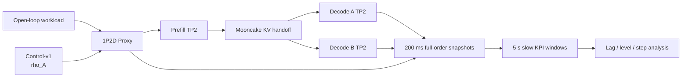

# ServingROM Round 14.1 Controlled Excitation Pilot 实验报告

## 1. 结论

本轮在同一个常驻 1P2D Pod 上完成 12/12 个正式 run，未重启模型、Engine、Mooncake 或 Pod。三个验收门均通过：

```text
persistent_excitation_pass = true
control_authority_pass     = true
data_quality_pass          = true
```

`rho_A` 对 Decode A/B 的新请求分配、运行中请求数量和 remaining-token inventory 产生稳定、方向正确且统计可区分的作用。12/12 run 均至少有一个直接 Decode 状态量满足预注册门槛，4 个 workload/load 工作点均为 3/3 通过。因此建议进入下一轮正式 Control Dataset 采集，但本轮严格停止在 actuator-response identification，不训练 Control-ROM，不实现 MPC。

## 2. 冻结系统

```text
Deployment : ray-vllm-pd-control-pilot-qwen36-27b
Pod UID    : 9f30dc6d-2570-4de9-adcf-f557b451c49e
restart    : 0
image      : sha256:0c9a4668e0c15f862fee733ab5c5b721e8f88985dd9cfa6f33404b976b15eadb
topology   : Prefill TP2 + Decode A TP2 + Decode B TP2
KV         : Mooncake
graph      : FULL_DECODE_ONLY
async      : enabled
actuator   : u=rho_A, rho_B=1-rho_A
safe range : [0.2, 0.8]
min dwell  : 5 s
max delta  : 0.2
```

只发生了一次获准的受控冷启动。此后 12 个正式 run 全部复用同一个 Pod、模型权重和 Engine 实例，通过 run-control 轮转旁路 telemetry writer。



## 3. 实验矩阵

每个 run 包含 120 秒 warmup、600 秒 excitation 和 inventory drain。每个工作点运行 PRBS、random-dwell 和 step 三类激励。

| Workload | Load | Arrival rate | PRBS | Random dwell | Step |
|---|---:|---:|---:|---:|---:|
| balanced | 55% | 0.275 req/s | PASS | PASS | PASS |
| balanced | 85% | 0.425 req/s | PASS | PASS | PASS |
| mixed-bimodal | 55% | 0.3575 req/s | PASS | PASS | PASS |
| mixed-bimodal | 85% | 0.5525 req/s | PASS | PASS | PASS |

总计生成 36,000 个 200 ms fast windows 和 1,440 个 5 s slow windows。

## 4. 数据质量

| 指标 | 结果 |
|---|---:|
| SEALED runs | 12/12 |
| 成功请求 | 2,848 |
| completion tokens | 339,136 |
| 请求错误 | 0 |
| event sequence gaps | 0 |
| JSONL damaged lines | 0 |
| writer failures/drops | 0 |
| KV lifecycle violations | 0 |
| request inventory conservation | 1.0（全部 run） |
| stage inventory conservation | 1.0（全部 run） |
| Pod/Engine restart | 0 |

每个 run 都包含 3,000 个有效 fast windows，`X[1804]`、`D[31]`、`Y[19]` 与真实 `U[1]` 完整对齐。`U` 只来自 `actuator_applied.effective_value`，实际请求比例与 token 比例仅作为诊断量。

## 5. 实际路由响应

下表按真实 routed request count 和 expected token mass 加权，避免低流量 5 秒窗口被过度放大。

| Workload/load | U | A request ratio | A token ratio |
|---|---:|---:|---:|
| balanced 55% | 0.3 | 0.313 | 0.300 |
| balanced 55% | 0.5 | 0.563 | 0.526 |
| balanced 55% | 0.7 | 0.676 | 0.658 |
| balanced 85% | 0.3 | 0.307 | 0.309 |
| balanced 85% | 0.5 | 0.546 | 0.549 |
| balanced 85% | 0.7 | 0.690 | 0.707 |
| mixed-bimodal 55% | 0.3 | 0.299 | 0.250 |
| mixed-bimodal 55% | 0.5 | 0.546 | 0.531 |
| mixed-bimodal 55% | 0.7 | 0.690 | 0.654 |
| mixed-bimodal 85% | 0.3 | 0.313 | 0.294 |
| mixed-bimodal 85% | 0.5 | 0.534 | 0.529 |
| mixed-bimodal 85% | 0.7 | 0.696 | 0.714 |

`rho_A=0.3/0.7` 的实际请求比例整体紧贴目标方向。token ratio 与 request ratio 不完全相同是预期行为：actuator 控制的是新请求选择概率，而每个请求的输出长度不同，尤其 mixed-bimodal 会放大有限样本中的 token-mass 偏差。`rho_A=0.5` 的 0.534–0.563 偏移也属于有限样本与分段随机到达结果，不应被解释为隐藏控制偏置。

## 6. Decode 状态控制权

下表为 `rho_A=0.7` 相对 `rho_A=0.3` 的平均 Cohen's d；正值表示提高 `rho_A` 后 A 相对 B 的状态量增加。

| Workload/load | Running imbalance | Waiting imbalance | Remaining-token imbalance |
|---|---:|---:|---:|
| balanced 55% | 1.176 | 0.535 | 0.786 |
| balanced 85% | 1.840 | 0.620 | 1.417 |
| mixed-bimodal 55% | 1.359 | 0.613 | 1.183 |
| mixed-bimodal 85% | 1.710 | 0.530 | 1.386 |

### 6.1 负载越高，控制权越容易观测

balanced 的 remaining-token effect 从 0.786 增至 1.417，mixed-bimodal 从 1.183 增至 1.386。高负载下同时驻留的请求更多，概率路由在任一时刻留下的 A/B inventory 差异更稳定，测量噪声相对减小。

### 6.2 Waiting 的效应弱于 Running 和 Remaining

waiting effect 约为 0.53–0.62，仍超过 0.25 门槛，但明显弱于 running。原因不是 actuator 失效，而是这些工作点尚未长期压满 Decode scheduler：许多窗口 waiting 为零或接近零，控制主要改变 running membership 和剩余 token mass，而不是形成持续 backlog。正式 Control Dataset 若要识别 congestion dynamics，应增加接近饱和但仍安全的工作点。

## 7. 时延和阶跃响应

在 5 秒 slow-window 分辨率下：

- 新请求路由和 running imbalance 通常在 0–5 秒内响应；
- remaining-token imbalance 的 step median delay 为 0–2.5 秒；
- remaining-token settling time 随工作点约为 7.5–20 秒；
- 85% mixed-bimodal 的 settling 较慢，符合长短请求混合造成 inventory 尾部的预期。

这里的 0 秒表示响应发生在命令所在的同一个 5 秒窗口，并不代表物理零延迟。要分解毫秒级 Proxy 决策、KV handoff 和 Decode admission 延迟，应回到 200 ms fast windows 或事件级时间戳。

PRBS run 中最强绝对相关有时出现在 35–40 秒且为负，这是交替 PRBS 近半周期的反相自相关，不是系统在 35 秒后产生反向因果响应。正式报告因此同时保存 `strongest_absolute` 与 `best_positive`，响应结论使用后者和 step response，不把 PRBS 半周期别名当作真实 lag。

## 8. 性能现象

工作点平均 TTFT P95：

| Workload/load | TTFT P95 mean |
|---|---:|
| balanced 55% | 4.744 s |
| balanced 85% | 3.701 s |
| mixed-bimodal 55% | 4.107 s |
| mixed-bimodal 85% | 4.697 s |

mixed-bimodal 从 55% 到 85% 的 TTFT 上升符合更高 Prefill/KV/Decode overlap 压力。balanced 85% 反而低于 55% 不能解释为负载提高改善延迟，因为不同 run 使用不同随机种子和有限请求样本，55% random-dwell 单轮 TTFT P95 为 6.737 秒，显著拉高均值。本轮目标是 actuator 可辨识性，不是负载间严格配对的性能 A/B。

## 9. 运行中故障与修复

第一个 random-dwell 尝试在恰好 5 秒边界提交 PREPARE，因网络和应用时间差比上一次 `applied_wall_ns + 5s` 略早，被 Control-v1 正确拒绝：

```text
409 minimum_dwell_time_not_met
```

campaign 按 fail-closed 规则停止并回滚 baseline。修复只对这个明确的拒绝原因以 100 ms 间隔重试；其他 409、generation/CAS、越界和健康错误仍立即失败。失败原始目录和旧 manifest 被保留，正式 12-run 集合不包含该尝试。成功 run 共记录 62 次 dwell-boundary 安全重试，均未改变实际生效顺序、最小 dwell 或路由语义。

## 10. 可辨识性判断

### Persistent excitation

PASS。12/12 run 均覆盖 0.3、0.5、0.7，`var(U) >= 0.005`，命令 generation、command ID、applied timestamp 和有效值完整。

### Control authority

PASS。12/12 run 至少一个直接 Decode 状态满足 `high-low > 0` 且 Cohen's d ≥ 0.25；每个工作点均为 3/3，而预注册门槛仅要求至少 2/3。

### 数据正确性

PASS。所有请求、阶段、KV 和 writer 守恒门通过，且 Pod UID、Engine 和模型在正式采集期间保持不变。

## 11. 下一步建议

可以进入正式 Control Dataset 采集，但下一轮应保留以下约束：

1. 继续使用同一 `U=rho_A` 语义和 `actuator_applied` 对齐方式；
2. 增加接近安全容量上沿的工作点，以激活 waiting/backlog dynamics；
3. 保留 PRBS、random-dwell 和 step，训练/验证/test 按完整 run 隔离；
4. 对 `rho_A=0.5` 增加重复 run，估计有限样本路由方差；
5. Control-ROM 选择应以 held-out rollout 和 transient 恢复能力为准，而非只看 one-step；
6. 在正式数据集封存前，不启动 MPC。

本轮到此停止：未扩大正式 Control Dataset，未训练 Control-aware DMDc，未实现 MPC。

## 12. 产物

```text
/servingrom-results/servingrom-control-pilot-v1/pilot_manifest.json
/servingrom-results/servingrom-control-pilot-v1/<run_id>/raw/
/servingrom-results/servingrom-control-pilot-v1/<run_id>/derived/control/
/servingrom-results/servingrom-control-pilot-v1/<run_id>/reports/
/servingrom-results/servingrom-control-pilot-v1/reports/CONTROL_EXCITATION_PILOT_REPORT.md
/servingrom-results/servingrom-control-pilot-v1/reports/CONTROL_EXCITATION_PILOT_REPORT.json
```
